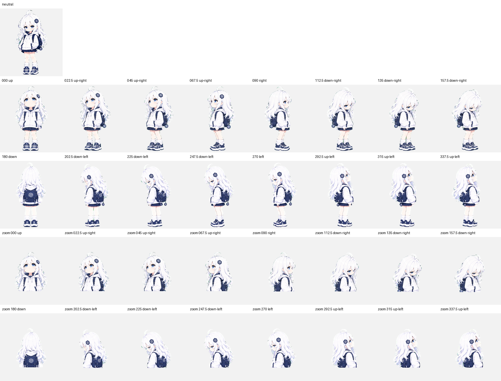

# Codex Pet

## Lumi

“Lumi” 来自 luminous，意为明亮、发光；这个名字对应角色的白色长发、蓝色眼睛和清爽的蓝白配色，也足够短，适合作为桌面宠物名称。

这是一个根据角色设定图制作的 Codex-compatible v2 动画宠物。

## 动作预览

| 动作 | 预览 |
| --- | --- |
| Idle |  |
| Running right |  |
| Running left |  |
| Waving |  |
| Jumping |  |
| Failed |  |
| Waiting |  |
| Running / working |  |
| Review |  |

### 方向预览

